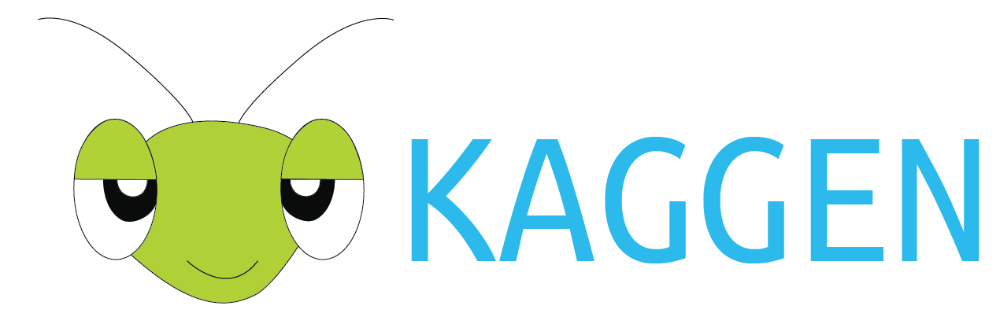

<div align="center">


**Flexible template code for deep learning pipelines**

[](https://www.python.org/downloads/release/python-370/) [](https://opensource.org/licenses/MIT) <!-- [](https://badge.fury.io/py/kaggen) [](https://pepy.tech/project/kaggen)  [](https://codecov.io/gh/jeffrey_wardman/kaggen) [](https://github.com/psf/black) -->

</div>

---

Kaggen is a light-weight, flexible Python library for quick prototyping for deep learning pipelines. The library originated from observations that notebooks in Kaggle competitions are typically based on the formatting of the first popular notebooks for training and inferencing pipelines. It's not rare for these to consist of non-production level code, (e.g. variables whose meaning is unclear).

The idea of this library is for it to be forked and used as the basis for these pipelines, with good software engineering principles already incorporated in the baseline. Basic changes can be done simply via the YAML config files, and various external resources can be included. More detailed changes can be done by forking and tweaking the code.

By continuing to use PyTorch rather than high-level API wrappers, users remain flexible in their approaches.

<!-- Tutorials, code examples, and the API reference are available at the documentation website which is [available here.](# TODO documentation website) -->

# Features

Kaggen allows preprocessing, training and inference pipelines to be generated (currently limited to classification for image-based problems).

### Coming Soon

- Python script to Jupyter notebook
  - Accommmodate for tqdm vs tqdm_notebook
- Configs stored in experiments.xlsx with changes highlighted between experiments
- Connect with Weights & Biases
- Custom models with shape determined from YAML file.
  - PyTorch model -> YAML file
  - External resources for layers
- Segmentation and other problems out-of-the-box
- GUI for non-programmers
- Automatic mixed precision
- Submit directly to Kaggle

# Installation

Install kaggen from PyPI with pip:

```
$ pip install kaggen
```

**Note: Requires python 3.7+**

# How to Use

Fork/clone and pip install package by navigating to directory and typing:

```
$ pip3 install -e .
```

Run/debug like any other module. For example:

```
$ python3.7 -m kaggen.train
```

To use a custom function, set the module name to the file containing the function, e.g. kaggen.train.optimizers and set the name to be the function name, e.g. SGD. For example:

```
optimizer:
  module: kaggen.train.optimizers
  name: SGD
```

To use a different/custom model, create a new class in the models file.

## How to use in offline Kaggle competition

- Build package wheel
- Upload to Kaggle
- Install from wheel

# Documentation

Build documents locally with:

```
$ cd docs && make html
```

### Tips

Create files where needed and use the below to import a functions from within the same file, or from other modules

```
# Same file
eval('function_name')(**input_args)

# Other modules
geattr(importlib.import_module('module_name'), 'function_name')(**input_args)
```

<!-- # Citing

If you are using kaggen for your research project or competition entry, we ask that you please cite it using one of the following bibtex citations:

    @inproceedings {kaggen,
        author = {Jeffrey Wardman},
        title = "",
        publisher = "",
        year = 2020
    } -->

# Issues and Contributions

See the [contribution guide](https://github.com/JeffreyWardman/kaggen/wiki/Contributing) for detailed information. Please see the issues page before contacting the author.

# Contributors

- Jeffrey Wardman -- <http://github.com/jeffreywardman>

# License

Kaggen is under an [MIT License](https://opensource.org/licenses/MIT)
